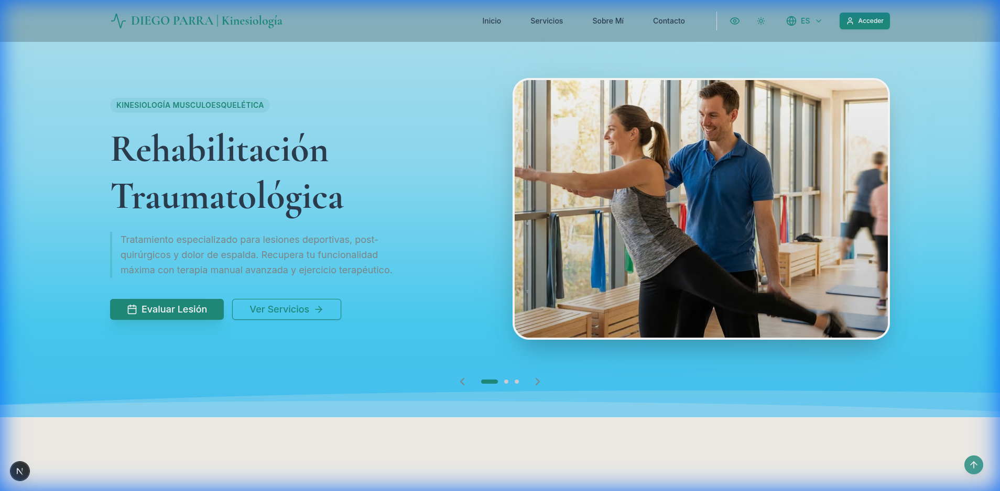
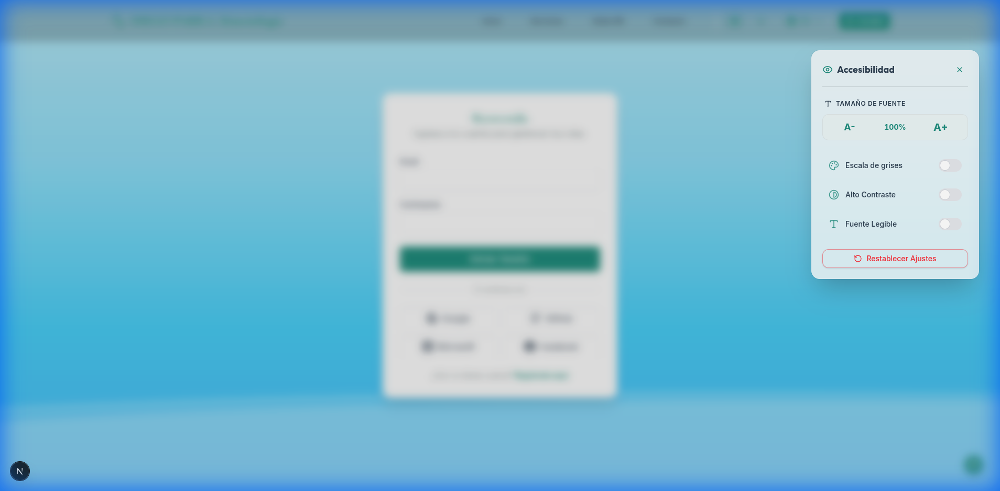
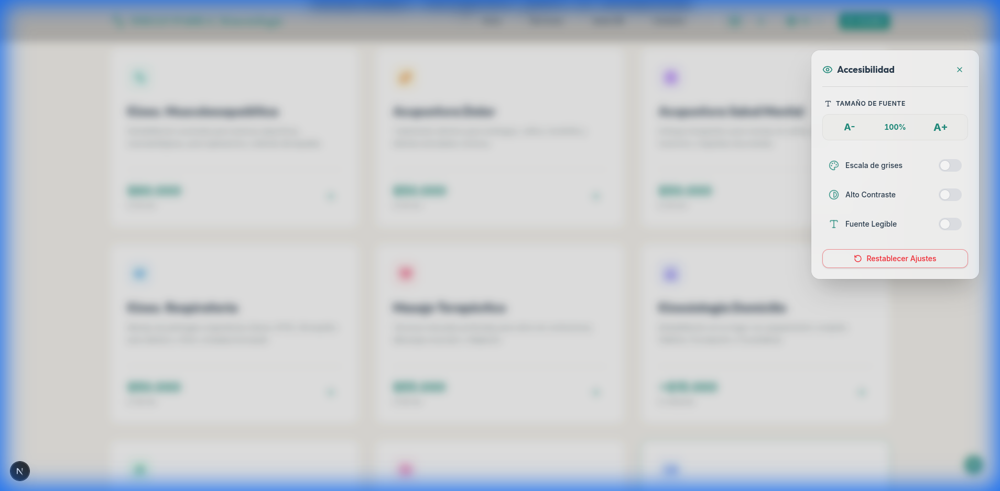
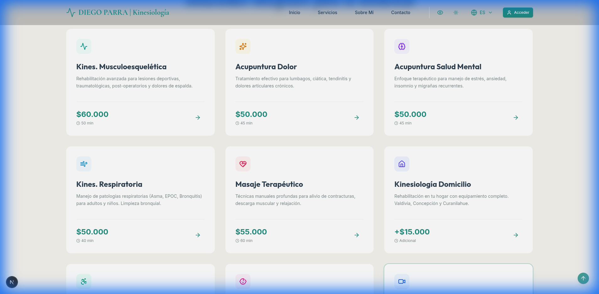

# Propuesta de Transformación Digital: Su Clínica, Reimaginada

**Para:** Diego Parra / Clínica Kinesiología Integral
**Fecha:** 8 de Diciembre de 2025
**Asunto:** Ecosistema Digital para Elevar la Experiencia del Paciente y Optimizar la Gestión Clínica

---

### **Resumen Ejecutivo: Más Allá de una Web, una Ventaja Competitiva**

Diego, hemos construido una solución digital que redefine la interacción con sus pacientes y automatiza la complejidad de su gestión diaria. No es simplemente un sitio web, sino un **ecosistema de bienestar digital** diseñado para una única misión: posicionar su clínica como líder en atención y eficiencia.

Esta plataforma transformará su operación, permitiéndole:
-   **Captar y Retener Pacientes:** A través de una experiencia online inolvidable y un portal de autoservicio que genera lealtad.
-   **Reducir la Carga Administrativa:** Automatizando agendamiento, gestión de fichas y comunicación, liberando su tiempo para lo que más importa: sus pacientes.
-   **Proyectar una Marca Premium:** Con un diseño de vanguardia ("Liquid Zen") que transmite calma, profesionalismo y confianza desde el primer contacto.

**Enlace a la Demostración Interactiva:** [**Ver Plataforma en Acción**](https://diepo-parra-5ywmlhxpu-jenovoas-projects.vercel.app)
*(Le invitamos a explorar la fluidez y facilidad de uso desde su computador o móvil.)*

---

### **1. Su Nueva Experiencia Digital: La Filosofía "Liquid Zen"**

Hemos creado una experiencia de usuario que no solo es funcional, sino también terapéutica. El diseño "Liquid Zen" utiliza animaciones fluidas, una paleta de colores serena y una navegación intuitiva para que cada interacción sea un reflejo de la calma y el bienestar que ofrece su clínica.

*Pantalla principal: Su carta de presentación digital, diseñada para inspirar confianza y facilitar el acceso a sus servicios.*

**Beneficios Clave para el Paciente:**

-   **Agendamiento 24/7 sin Fricción:** Sus pacientes pueden reservar, modificar o cancelar citas en cualquier momento y desde cualquier dispositivo, eliminando llamadas y aumentando la ocupación de su agenda.
-   **Portal del Paciente Personalizado:** Un espacio privado donde sus pacientes gestionan su salud: historial de citas, comunicación directa y acceso a su información clínica de forma segura.
    
    *Acceso seguro al centro de control del paciente.*
-   **Accesibilidad para Todos:** Con nuestro widget de accesibilidad, personas mayores o con dificultades visuales pueden ajustar la interfaz (texto, contraste), asegurando que su clínica sea verdaderamente inclusiva. Un diferenciador clave frente a la competencia.
    
    *Demostración del compromiso de su clínica con la inclusión digital.*

---

### **2. Su Centro de Mando: Gestión Clínica Simplificada**

El corazón de la plataforma es un potente panel de administración diseñado para darle control total con el mínimo esfuerzo.

*Gestión visual e intuitiva de los servicios que ofrece su clínica.*

**Capacidades de Gestión:**

-   **Administración Centralizada:** Controle fichas de pacientes, agenda, historial clínico y servicios desde un único lugar.
-   **Seguridad de Grado Médico:** Implementamos encriptación AES-256 y arquitectura de datos robusta, garantizando la confidencialidad y el cumplimiento de normativas de protección de datos del paciente (Leyes 19.628 y 20.584).
-   **Inteligencia de Negocio:** La plataforma está preparada para generar reportes que le darán visibilidad sobre el rendimiento de su clínica (futuras fases).

---

### **3. Arquitectura Robusta: Construida para el Futuro**

Para garantizar velocidad, seguridad y escalabilidad, hemos utilizado un stack tecnológico de última generación.

-   **Frontend:** Next.js (React) y Tailwind CSS para una experiencia de usuario ultrarrápida y adaptable a cualquier dispositivo.
-   **Animaciones:** Framer Motion para dar vida al diseño "Liquid Zen" sin comprometer el rendimiento.
-   **Backend y Base de Datos:** TypeScript y Prisma ORM para un código estable y un manejo de datos seguro y eficiente.
-   **Seguridad:** Autenticación robusta con NextAuth.js para proteger el acceso a la información.

---

### **4. Hoja de Ruta: Crecimiento Continuo**

Esta plataforma es el cimiento. Proponemos una evolución para seguir agregando valor a su clínica:

-   **Fase 1 (Inmediato):** Integración con el SII para la emisión de boletas electrónicas automáticas.
-   **Fase 2 (Corto Plazo):** Lanzamiento del módulo de **Telemedicina**, integrando video-consultas en la plataforma.
-   **Fase 3 (Mediano Plazo):** Integración con sistemas de seguros (Imed/Medipass) para la venta de bonos en línea.

---

### **5. Próximos Pasos y Propuesta de Valor**

Hemos completado el desarrollo y las pruebas de calidad. La plataforma está lista para ser su principal herramienta de gestión y marketing.

**Recomendación:** Desplegar la plataforma en un entorno de producción en **Vercel**, lo que nos proporciona un rendimiento global, seguridad y actualizaciones continuas sin interrupciones.

**Nuestra propuesta es simple:** Le entregamos una solución digital completa, lista para usar, que moderniza su operación y eleva la percepción de su marca.

---

### **Conclusión: El Futuro de su Práctica Empieza Hoy**

Esta no es una simple entrega de software. Es el inicio de una transformación digital que le permitirá competir a un nivel superior, ofreciendo una experiencia de paciente excepcional y optimizando sus recursos.

Estamos listos para dar el siguiente paso y llevar su clínica al mundo digital. Quedamos a su disposición para coordinar el despliegue final.